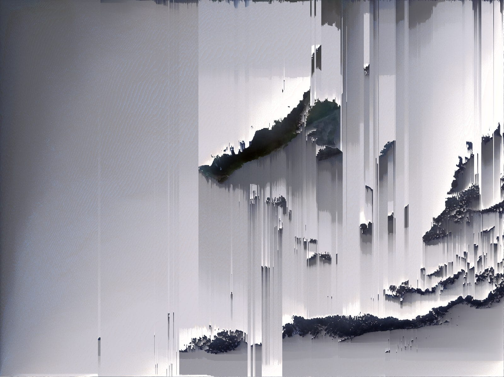
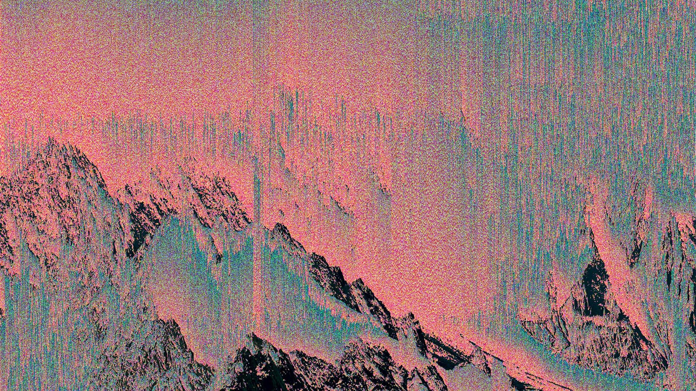

# Quiz-8_sdai0419

Example: Digital glitch art, specifically the work of Kim Asendorf.
I want to incorporate "Pixel Sorting," a technique that reorders pixels in an image based on their brightness or color values. I find the "melting" or "bleeding" effect it creates to be visually striking. This is beneficial for my project because it adds a sense of digital decay and organized chaos. It allows me to transform a standard photograph into something abstract while maintaining the original color palette.

https://happycoding.io/tutorials/p5js/images/pixel-sorter
Coding Technique: Array sorting based on brightness thresholds.(p5.js)
This technique works by reading the color data of an image into a 1D or 2D array and then applying a sorting algorithm (like Quicksort) to specific segments of pixels. By setting a "threshold," the code only sorts pixels that are darker or lighter than a certain value, creating those distinct vertical or horizontal streaks. This allows for precise control over which parts of the image remain recognizable and which become abstract textures.

